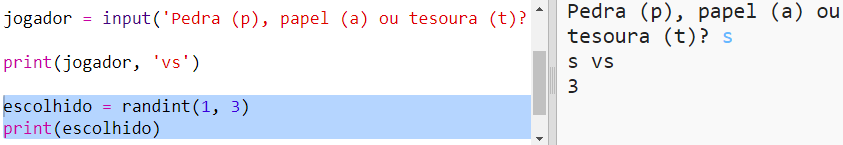
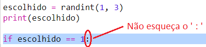
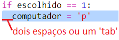
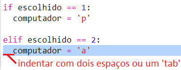
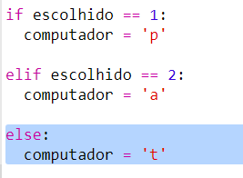
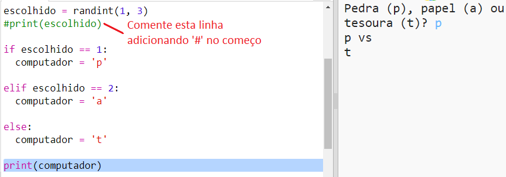
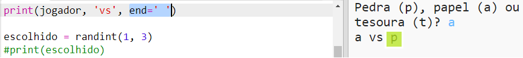

## Turno do Computador

Agora é a vez do computador. Você pode usar a função `randint` para gerar um número aleatório para decidir entre pedra, papel ou tesoura.

+ Use `randint` para gerar um número aleatório para decidir se o computador escolheu rocha, papel ou tesoura.
    
    

+ Execute o seu script várias vezes (você precisará digitar 'p', 'a' ou 't' a cada vez.)
    
    Você deve ver que 'escolhido' é aleatoriamente definido como 1, 2 ou 3.

+ Digamos:
    
    + 1 = pedra (p)
    + 2 = papel (a)
    + 3 = tesoura (t)
    
    Use `if` para verificar se o número escolhido é `1` (`==` é usado para ver se os dois números são iguais).
    
    

+ O Python usa **indentação** (mover o código para a direita) para mostrar qual código está dentro do `if`. Você também pode usar dois espaços (pressione a barra de espaço duas vezes) ou pressionar a **tecla Tab** (normalmente acima da tecla CAPS LOCK no teclado)
    
    Defina `computador` para 'p' dentro do `if` usando indentação:
    
    

+ Você pode adicionar uma verificação alternativa usando `elif` (abreviação de *else if*):
    
    
    
    Esta condição só será verificada se a primeira condição falhar (se o computador não tiver escolhido `1`)

+ E, finalmente, se o computador não escolheu `1` ou `2` , então ele deve ter escolhido `3`.
    
    Desta vez podemos usar `else`, o que significa ao contrário.
    
    

+ Agora, em vez de imprimir o número aleatório que o computador escolheu, você pode imprimir a letra.
    
    
    
    Você pode excluir a linha `print(escolhido)`ou fazer com que o computador a ignore, adicionando um `#` no início da linha.

+ Teste seu código clicando em 'Run' e escolhendo sua opção.

+ Hmm, a escolha do computador é impressa em uma nova linha. Você pode corrigir isso adicionando `end = ' '` após `vs`, que diz ao Python para terminar com um espaço em vez de uma nova linha.
    
    

+ Jogue o jogo algumas vezes clicando em 'Run' e fazendo uma escolha.
    
    Por enquanto, você terá que descobrir quem ganhou por si mesmo. Em seguida, você adicionará o código Python para resolver isso.