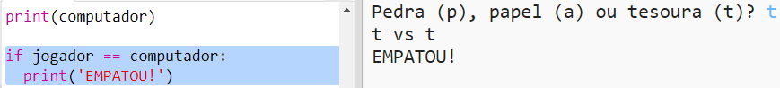
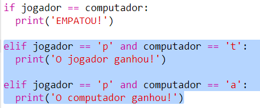
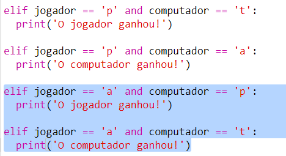
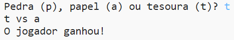

## Verifique o resultado

Agora vamos adicionar o código para ver quem ganhou.

+ Você precisa comparar as variáveis ​​do `jogador` e `computador` para ver quem ganhou.
    
    Se eles têm os mesmos valores, então é um empate:
    
    

+ Teste seu código jogando o jogo algumas vezes até conseguir um empate.
    
    Você precisará clicar em `Run` para iniciar um novo jogo.

+ Agora vamos ver os casos em que o jogador escolheu 'p' (pedra), mas o computador não.
    
    Se o computador escolher 't' (tesoura), o jogador ganha (A pedra quebra a tesoura).
    
    Se o computador escolher 'p' (papel), o computador ganha (O papel embrulha a pedra).
    
    Podemos verificar a escolha do jogador *e* a escolha do computador usando `and`.
    
    

+ Em seguida, vamos ver os casos em que o jogador escolheu 'a' (papel), mas o computador não:
    
    

+ E finalmente, você pode adicionar o código para verificar o vencedor quando o jogador escolheu 't' (tesoura) e o computador escolheu pedra ou papel?

+ Agora jogue o jogo para testar seu código.
    
    
    
    Clique em `Run` para iniciar um novo jogo.