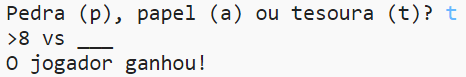
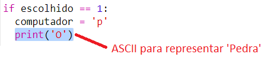
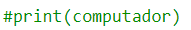
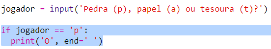

\--- challenge\---

## Desafio: Arte ASCII

Em vez de usar as letras 'p', 'a' e 't' para representar pedra, papel e tesoura, você pode usar arte ASCII?

Por exemplo:

Onde:

    pedra: O
    papel: ___
    tesoura: >8
    

+ Em vez de usar`print(computer)` você precisará adicionar uma nova linha a cada uma das opções no `if` para apresentar a arte ASCII correta. 

Dica:

+ Em vez de dizer `print(jogador)` você precisará adicionar uma nova instrução if para verificar qual item o jogador escolheu e imprimir a arte ASCII correta:

Dica:

Lembre-se de que adicionar `end = ' '` ao final de uma `print` faz com que ele termine com um espaço em vez de uma nova linha.

\--- /challenge \---