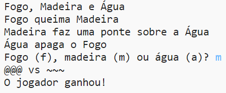

--- challenge---

## Desafio: Crie um jogo novo

Você pode criar seu próprio jogo como Pedra, Papel e Tesoura com diferentes objetos?

Clique no botão "Remix" para fazer uma cópia do projeto Pedra, Papel e Tesoura para começar.

Este exemplo usa Fogo, Madeira e Água:

--- /challenge ---

Tradução Contribuída pela Comunidade

Este projeto foi traduzido por Matias Moretti e revisado por Elton Marques.

Nossos incríveis voluntários de tradução nos ajudam a dar as crianças em todo o mundo a oportunidade de aprender a programar. Você pode nos ajudar a alcançar mais crianças traduzindo nossos projetos - leia mais em [rpf.io/translators](https://rpf.io/translators).