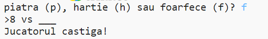

## Introducere

În acest proiect vei crea un joc de Piatră, Hârtie, Foarfece și vei juca împotriva calculatorului.

Reguli: Tu și calculatorul veți alege fiecare piatră, hârtie sau foarfece. Câștigătorul este ales în funcție de următoarele reguli:

* Piatra tocește foarfecele
* Hârtia acoperă piatra
* Foarfecele taie hârtia

  <iframe src="https://trinket.io/embed/python/eac024720e?outputOnly=true&start=result" width="600" height="500" frameborder="0" marginwidth="0" marginheight="0" allowfullscreen>
  </iframe>
  

### Informații suplimentare pentru liderii cluburilor

Dacă dorești să imprimi acest proiect, te rugăm să folosești [Versiunea pentru imprimare](https://projects.raspberrypi.org/ro-RO/projects/rock-paper-scissors/print).

--- collapse ---
---
title: Note pentru conducătorul clubului
---

## Introducere:

În acest proiect, copiii vor învăța cum să creeze un program care joacă Piatră, Hârtie, Foarfece folosind variabile și structuri condiționale.

## Resurse online

**Acest proiect utilizează Python 3.** Îți recomandăm să utilizezi [trinket](https://trinket.io/) pentru a scrie cod în Python online. Acest proiect conține următoarele Trinket-uri:

* [Resurse "Piatră, Hârtie, Foarfece" -- jumpto.cc/rps-go](http://jumpto.cc/rps-go)

Există, de asemenea, un trinket care conține proiectul final:

* ["Piatră, Hârtie, Foarfece" finalizat -- trinket.io/python/e1e1d873be](https://trinket.io/python/eac024720e)

## Resurse offline

Acest proiect poate fi [completat offline](https://www.codeclubprojects.org/en-GB/resources/python-working-offline/) dacă dorești. Poți accesa resursele proiectului dând click pe link-ul "Materialele proiectului" pentru acest proiect. Acest link conține o secțiune "Resursele proiectului" care include resurse de care copiii vor avea nevoie pentru a completa acest proiect offline. Asigură-te că fiecare copil are acces la o copie a acestor resurse. Această secțiune include următoarele fișiere:

* rock-paper-scissors/rock-paper-scissors.py

De asemenea, poți găsi proiectul finalizat în secțiunea "Resurse pentru voluntari", care conține:

* rock-paper-scissors-finished/rock-paper-scissors.py

(Toate resursele de mai sus pot fi descărcate și ca fișiere `.zip`.)

## Obiective de învățare

* Variabile;
* Selecție (`if`, `elif`, `else`); 
* Boolean `==` și `and`.

Acest proiect acoperă elemente din următoarele domenii [Raspberry Pi Digital Making Curriculum](http://rpf.io/curriculum):

* [Folosirea unor structuri de bază în programare pentru a crea programe simple.](https://www.raspberrypi.org/curriculum/programming/creator)

## Provocări

* "Arta ASCII" - Utilizează logica condițională pentru a afișa artă ASCII pentru piatră, hârtie, respectiv foarfece. 
* "Creează un joc nou" - Duplică jocul Piatră, Hârtie, Foarfece și modifică-l pentru a crea un joc nou. 

--- /collapse ---

--- collapse ---
---
title: Materialele proiectului
---

## Resursele proiectului

* [fişier .zip care conține toate resursele proiectului](resources/rock-paper-scissors-project-resources.zip)
* [Trinket online care conține toate resursele proiectului "Piatră, Hârtie, Foarfece"](http://jumpto.cc/rps-go)
* [rock-paper-scissors/rock-paper-scissors.py](resources/rock-paper-scissors-rock-paper-scissors.py)

## Resurse pentru conducătorul clubului

* [fișier .zip care conține toate resursele proiectului, completate](resources/rock-paper-scissors-volunteer-resources.zip)
* [Proiect Trinket online, completat](https://trinket.io/python/eac024720e)
* [rock-paper-scissors-finished/rock-paper-scissors.py](resources/rock-paper-scissors-finished-rock-paper-scissors.py)

--- /collapse ---