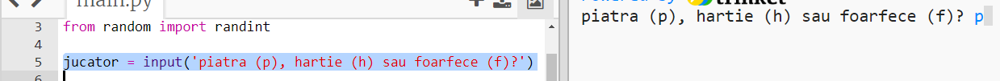
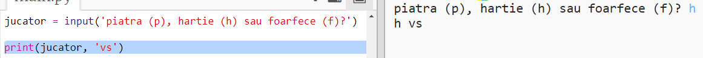

## Rândul jucătorului

Întâi, permite jucătorului să aleagă dintre Piatră, Hârtie sau Foarfece.

+ Deschide acest trinket: <a href="http://jumpto.cc/rps-go" target="_blank">jumpto.cc/rps-go</a>.

+ Proiectul deja conține codul necesar importării unei funcții pe care o vei folosi în acest proiect.
    
    
    
    Vei utiliza `randint` mai târziu pentru a genera numere la întâmplare.

+ Întâi, lasă jucătorul să aleagă dintre Piatră, Hârtie și Foarfece prin tastarea literei "p", "h" sau "f".
    
    

+ Acum afișează ce a ales jucătorul:
    
    

+ Testează codul apăsând `Run`. Apasă în fereastra de afișare a trinket-ului și introdu alegerea ta.