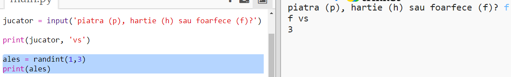
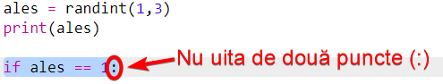
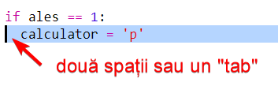
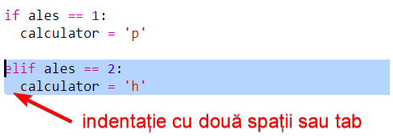
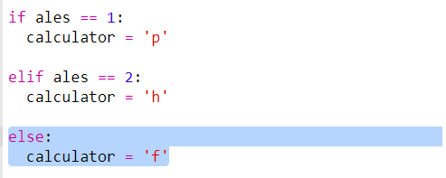
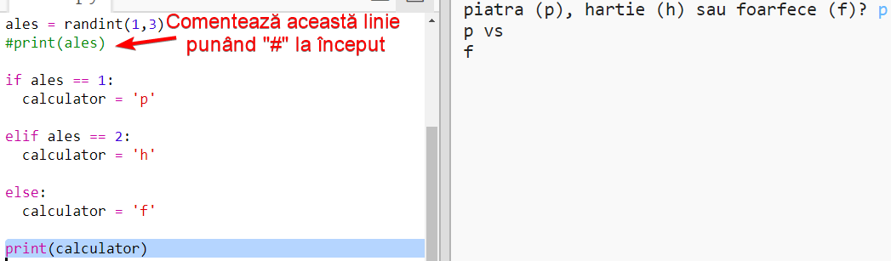
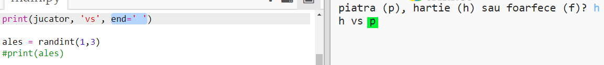

## Rândul calculatorului

Acum este rândul calculatorului. Poți utiliza funcția `randint` pentru a genera un număr aleatoriu și a decide dintre piatră, hârtie și foarfece.

+ Folosește `randint` pentru a genera un număr aleatoriu și a decide ce a ales calculatorul: piatră, hârtie sau foarfece.
    
    

+ Rulează programul de multe ori (va trebui să introduci "p", "h" sau "f" de fiecare dată.)
    
    Ar trebui să vezi că "ales" a fost setat aleatoriu ca 1, 2 sau 3.

+ Să zicem:
    
    + 1 = piatră (p)
    + 2 = hârtie (h)
    + 3 = foarfece (f)
    
    Folosește `if` pentru a verifica dacă numărul ales este `1` (`==` este folosit pentru a vedea dacă două lucruri sunt la fel).
    
    

+ Python foloseste **indentația** (mutarea codului către dreapta) pentru a arăta care cod se află interiorul structurii `if`. Poți folosi atât două spații (apasă tasta spațiu de două ori), cât și **tasta tab** (de obicei, situată deasupra tastei CAPSLOCK pe tastatură.)
    
    Setează `calculator` ca "p" în interiorul `if`-ului folosind indentația:
    
    

+ Poți adăuga o verificare alternativă utilizând `elif` (prescurtare pentru *else if*):
    
    
    
    Această condiție va fi verificată dacă și numai dacă prima condiție eșuează (în cazul în care calculatorul nu a ales `1`)

+ În cele din urmă, dacă alegerea calculatorului nu a fost nici `1`, nici `2`, atunci trebuie să fi fost `3`.
    
    De această dată putem să folosim `else` care înseamnă altfel.
    
    

+ Acum, în loc să afișăm numărul aleator pe care l-a ales calculatorul, putem afișa litera.
    
    
    
    Poți fie să ștergi linia `print(ales)`, fie să faci calculatorul să o ignore prin adăugarea unui `#` la începutul liniei.

+ Testează codul apăsând pe Run și alegând opțiunea ta.

+ Hmm, alegerea calculatorului este afișată pe o linie nouă. Poți rezolva asta adaugând `end=' '` după `vs`. Astfel, Python va încheia rândul cu un spațiu în loc să încheie cu o linie nouă.
    
    

+ Joacă jocul de câteva ori apăsând pe Run și făcând o alegere.
    
    Pentru moment, va trebui să decizi tu cine a câștigat. La pasul următor, vei adăuga codul Python care să stabilească automat cine a câștigat.