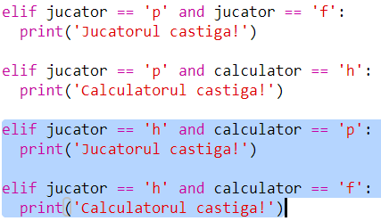

## Verifică rezultatul

Acum, să adăugăm codul pentru a vedea cine a câștigat.

+ Trebuie să compari variabilele `jucator` și `calculator` pentru a vedea cine a câștigat.
    
    Dacă sunt la fel, atunci este egalitate:
    
    

+ Testează codul jucând de câteva ori până când obții o remiză.
    
    Va trebui să apeși pe `Run` pentru a începe un joc nou.

+ Acum, să examinăm cazurile în care jucătorul alege "p" (piatră), iar calculatorul alege altceva.
    
    În cazul în care calculatorul a ales "f" (foarfece), atunci jucătorul câștigă (piatra bate foarfecele).
    
    În cazul în care calculatorul a ales "h" (hârtie), atunci calculatorul câștigă (hârtia bate piatra).
    
    Putem verifica alegera jucătorului *și* alegerea calculatorului utilizând `and`.
    
    

+ Mai departe, să examinăm cazurile în care jucătorul alege "h" (hârtie), iar calculatorul alege altceva:
    
    

+ Și în final, poți adăuga codul pentru a verifica cine a câștigat când jucătorul alege "f" (foarfece) și calculatorul alege piatră sau hârtie?

+ Acum joacă-te și testează codul.
    
    
    
    Apasă `Run` pentru a începe un joc nou.