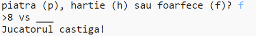
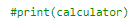
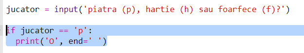

\--- challenge \---

## Provocare: Arta ASCII

În loc să folosești literele p, h și f pentru a reprezenta piatră, hârtie, respectiv foarfece, poți folosi arta ASCII?

De exemplu:

Unde:

    piatră: O
    hârtie: ___
    foarfece: >8
    

+ În loc să scrii `print(calculator)` va trebui să adaugi o nouă linie fiecărei opțiuni din `if` pentru a afișa arta ASCII potrivită. 

Indicii:

+ În loc să scrii `print(jucator)` va trebui să adaugi o nouă instrucțiune if pentru a verifica ce a ales jucătorul și să afișezi arta ASCII potrivită:

Indiciu:

Reține că dacă adaugi `end=' '` la sfârșitul unui `print`, rândul se va termina cu un spațiu în loc să se termine cu o linie nouă.

\--- /challenge \---