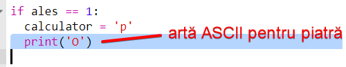

\--- challenge \---

## Provocare: Arta ASCII

În loc să folosești literele p, h și f pentru a reprezenta piatră, hârtie, respectiv foarfece, poți folosi arta ASCII?

De exemplu:

Unde:

    piatră: O
    hârtie: ___
    foarfece: >8
    

+ Instead of saying `print (computer)` you'll need to add a new line to each of the options in the `if` to print out the correct ASCII art. 

Indicii:

+ Instead of saying `print (player)` you'll need to add a new if statement to check which item the player chose and print out the correct ASCII art:

Indiciu:

Reține că dacă adaugi `end=' '` la sfârșitul unui `print`, rândul se va termina cu un spațiu în loc să se termine cu o linie nouă.

+ Include a line to print `vs` between the player and computer results.

    print('vs', end=' ')
    

\--- /challenge \---