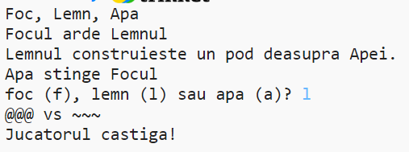

--- challenge ---

## Provocare: Creează un joc nou

Poți crea propriul tău joc ca cel de Piatră, Hârtie, Foarfece cu alte obiecte?

Apasă pe butonul "Duplicate" pentru a crea o copie a proiectului tău de Piatră, Hârtie, Foarfece de unde poți începe.

Acest exemplu folosește Focul, Lemnul și Apa:

--- /challenge ---

**Traducere realizată de comunitate** 

Proiectul a fost tradus de **Iulian Alexa** și verificat de **Cristian Iacob**.

Traducătorii noștri voluntari ne ajută să oferim copiilor din întreaga lume șansa de a învăța să programeze. Ne poți ajuta să ajungem la mai mulți copii, ajutând la traducerea proiectelor noastre – află mai multe pe rpf.io/translators.