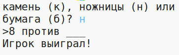

## Введение

В этом проекте ты создашь игру «Камень, ножницы, бумага» и сыграешь в неё против компьютера.

Правила: ты и компьютер выбираете камень, ножницы или бумагу. Победитель определяется по следующим правилам:

* Камень тупит ножницы
* Бумага покрывает камень
* Ножницы режут бумагу

  <iframe src="https://trinket.io/embed/python/e1e1d873be?outputOnly=true&start=result" width="600" height="500" frameborder="0" marginwidth="0" marginheight="0" allowfullscreen>
  </iframe>
  

### Дополнительная информация для руководителей клуба

Если вам нужно распечатать этот проект, пожалуйста, используйте [Версию для печати](https://projects.raspberrypi.org/en/projects/rock-paper-scissors/print).

## \--- collapse \---

## title: Заметки для руководителя клуба

## Введение:

В этом проекте дети узнают, как написать программу, которая позволяет играть в «Камень, ножницы, бумагу», используя переменные и операторы ветвления.

## Интернет-ресурсы

**В этом проекте используется Python 3.** Мы рекомендуем использовать [trinket](https://trinket.io/), чтобы программировать на Python онлайн. В этом проекте используются следующие trinket-ы:

* [Ресурсы «Камень, ножницы, бумага» -- jumpto.cc/rps-go](http://jumpto.cc/rps-go)

Имеется также trinket, содержащий завершённый проект:

* [Завершённый проект «Камень, ножницы, бумага» -- trinket.io/python/e1e1d873be](https://trinket.io/python/e1e1d873be)

## Оффлайн ресурсы

Этот проект может быть [завершён в автономном режиме](https://www.codeclubprojects.org/en-GB/resources/python-working-offline/), если это предпочтительнее. Вы можете получить доступ к ресурсам этого проекта, щёлкнув в нём ссылку «Материалы проекта». Эта ссылка содержит раздел «Ресурсы проекта», включающий ресурсы, которые понадобятся детям, чтобы завершить этот проект в режиме оффлайн (автономном режиме). Убедитесь, что у каждого ребёнка есть доступ к копии этих ресурсов. Этот раздел содержит следующие файлы:

* rock-paper-scissors/rock-paper-scissors.py

Вы также можете найти завершённую версию этого проекта в разделе «Ресурсы для волонтёров», который содержит:

* rock-paper-scissors-finished/rock-paper-scissors.py

(Все вышеперечисленные ресурсы также можно загрузить как файлы project и volunteer `.zip`.)

## Цели обучения

* Переменные;
* Выбор (операторы ветвления) (`if`, `elif`, `else`); 
* Логические операции `==` и `and`.

Этот проект затрагивает элементы из следующих глав [Учебного курса по цифровому изготовлению с Raspberry Pi](http://rpf.io/curriculum):

* [Используй базовые конструкции программирования для создания простых программ.](https://www.raspberrypi.org/curriculum/programming/creator)

## Задачи

* «ASCII-графика» — Используй условную логику (операторы ветвления), чтобы отобразить ASCII-графику для камня, ножниц и бумаги. 
* «Создай свою игру» — Скопируй коды игры «Камни, ножницы, бумага» и измени её, чтобы создать свою игру. 

\--- /collapse \---

## \--- collapse \---

## title: Материалы проекта

## Ресурсы проекта

* [.zip-файл, содержащий все ресурсы проекта](resources/rock-paper-scissors-project-resources.zip)
* [Тринкет, содержащий все ресурсы проекта «Камень, ножницы, бумага» (онлайн)](http://jumpto.cc/rps-go)
* [rock-paper-scissors/rock-paper-scissors.py](resources/rock-paper-scissors-rock-paper-scissors.py)

## Ресурсы для руководителя клубов

* [.zip-файл, содержащий все ресурсы завершенного проекта](resources/rock-paper-scissors-volunteer-resources.zip)
* [Завершенный проект в trinket (онлайн)](https://trinket.io/python/e1e1d873be)
* [rock-paper-scissors-finished/rock-paper-scissors.py](resources/rock-paper-scissors-finished-rock-paper-scissors.py)

\--- /collapse \---