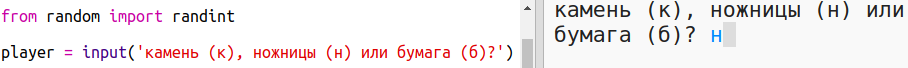
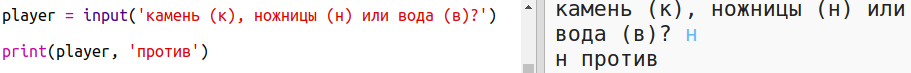

## Очередь игрока

Сперва дай возможность пользователю выбрать камень, ножницы или бумагу.

+ Открой этот trinket: <a href="http://jumpto.cc/rps-go" target="_blank">jumpto.cc/rps-go</a>.

+ Проект уже содержит код для импорта функции, которая тебе понадобится далее.
    
    
    
    Ты можешь использовать `randint` для генерации случайных чисел.

+ Сперва дай возможность пользователю выбрать камень, ножницы или бумагу, нажимая на клавиши 'к' (камень), 'н' (ножницы), 'б' (бумага) или 'r' (rock), 'p' (paper) и 's' (scissors).
    
    

+ Теперь выведи на экран то, что выбрал игрок:
    
    

+ Протестируй свой код, кликнув на `Run`. Кликни по окну вывода trinket-а и введи свой выбор.