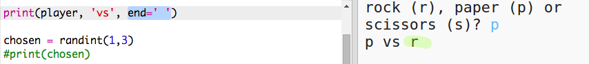

## Очередь компьютера

Теперь очередь за компьютером. Ты можешь использовать функцию `randint`, чтобы сгенерировать случайное число, согласно которому будут выбраны камень, ножницы или бумага.

+ Используй `randint` для генерации случайного числа, согласно которому будут выбраны камень, ножницы или бумага.
    
    

+ Запусти твой скрипт много раз (каждый раз тебе потребуется вводить 'к', 'н' или 'б').
    
    Заметь, что переменная 'chosen' принимает случайное значение, равное 1, 2 или 3.

+ Предположим, что:
    
    + 1 = камень (к) или rock (r)
    + 2 = бумага (б) или paper (p)
    + 3 = ножницы (н) или scissors (s)
    
    Используй `if`, чтобы проверить, равняется ли сгенерированное число `1` (равны ли два числа можно выяснить с помощью `==`).
    
    

+ В Python используются **отступы** (перенос кода вправо), чтобы указать компьютеру, что код находится внутри `if`. Ты можешь использовать либо два пробела (нажимая пробел дважды), либо **клавишу Tab** (обычно находится над клавишей CAPSLOCK клавиатуры.)
    
    Присвой переменной `computer` значение 'к' (или 'r') внутри блока `if`, используя отступы:
    
    

+ Ты можешь добавить ещё одну проверку, используя `elif` (сокращение от *else if*):
    
    
    
    Это условие будет проверено, только если первое условие будет иметь негативный результат (если компьютер выбрал не `1`)

+ Ну и, наконец, если компьютер не выбрал `1` или `2` то он, должно быть, выбрал `3`.
    
    В таком случае мы можем использовать просто `else`, который означает «иначе».
    
    

+ Теперь вместо того, чтобы выводить случайное число, выбранное компьютером, на экран ты можешь вывести букву.
    
    
    
    Ты можешь либо удалить строку с `print(chosen)`, либо заставить компьютер её игнорировать, добавив `#` в её начало строки.

+ Протестируй свой код, нажимая Run и делая выбор.

+ Хм, выбор компьютера выводится на новой строке. Чтобы это исправить, добавь `end=' '` после `vs` — так ты сообщишь Python, что вывод нужно закончить пробелом, а не новой строкой.
    
    

+ Сыграй в игру несколько раз, нажимая Run и делая выбор.
    
    Пока что тебе приходится самому определять победителя. Далее ты добавишь код на Python, чтобы компьютер сам определял победителя.