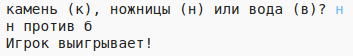

## Проверь результат

Теперь давай добавим код, определяющий победителя.

+ Тебе нужно сравнить переменные `player` и `computer`, чтобы определить победителя.
    
    Если переменные равны, то это ничья:
    
    

+ Протестируй твой код, запуская игру до тех пор, пока не получится ничья.
    
    Тебе нужно нажать `Run`, чтобы начать новую игру.

+ Теперь давай рассмотрим случаи, в которых игрок выбирает 'к' (камень), а компьютер выбирает что-то другое.
    
    Если компьютер выбрал 'н' (ножницы), то игрок выигрывает (камень побеждает ножницы).
    
    Если компьютер выбрал 'б' (бумага), то компьютер выигрывает (бумага побеждает камень).
    
    Мы можем проверить выбор игрока *и* выбор компьютера, используя `and`.
    
    

+ Далее давай рассмотрим случаи, когда игрок выбрал 'б' (бумага), а компьютер выбрал что-то другое:
    
    

+ Ну и, наконец, можешь ли ты добавить код, который бы определял победителя, если игрок выбрал 'н' (ножницы), а компьютер выбрал камень или бумагу?

+ Теперь поиграй в игру, чтобы протестировать твой код.
    
    
    
    Тебе нужно нажать `Run`, чтобы начать новую игру.