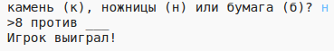
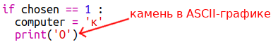
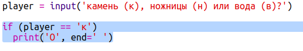

\--- challenge \---

## Задача: ASCII-графика

Можешь ли ты вместо того, чтобы использовать буквы к, н и б для обозначения камня, ножниц и бумаги, задействовать ASCII-графику?

Например:

Где:

    камень: O
    ножницы: >8
    бумага: ___
    

+ Вместо команды `print(computer)` тебе понадобится добавить по новой строке для каждого варианта в `if`, чтобы отобразить правильный ASCII-символ. 

Подсказки:

+ Вместо команды `print(player)` тебе придётся создать новое условие if, чтобы проверить, какой объект выбрал игрок и вывести соответствующий ASCII-символ:

Подсказка:

Помни, что добавление `end=' '` в конце `print` завершает вывод строки пробелом, а не переходом к новой строке.

\--- /challenge \---