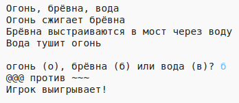

\--- challenge \---

## Задача: создай свою игру

Можешь ли ты создать свою собственную игру по типу «Камень, ножницы, бумага», но с другими объектами?

Нажми кнопку «Duplicate», чтобы сделать копию проекта «Камень, ножницы, бумага», с которой ты начнёшь создавать свою игру.

В этом примере используются огонь, полено и вода:

\--- /challenge \---