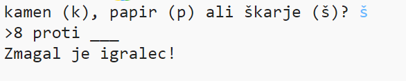

## Uvod

V tej igri boš ustvaril igro 'Kamen, škarje, papir' in jo zaigral proti računalniku.

Pravila: Igralec in zmagovalec izbirata med kamnom, škarjami in papirjem. Zamgovalec je določen na podlagi teh pravi:

* Kamen otopi škarje
* Papir zavije kamen
* Škarje režejo papir

  <iframe src="https://trinket.io/embed/python/e1e1d873be?outputOnly=true&start=result" width="600" height="500" frameborder="0" marginwidth="0" marginheight="0" allowfullscreen>
  </iframe>
  

### Dodatne informacije za vodje klubov

Za tiskanje tega projekta, prosimo uporabite [tiskalniku prijazno različico](https://projects.raspberrypi.org/en/projects/rock-paper-scissors/print).

## \--- collapse \---

## title: Opombe za vodje klubov

## Uvod:

V tem projektu se bodo otroci naučili ustvariti igro Kamen, škarje, papir, pri čemer bodo uporabljali spremenljivke in pogojne stavke.

## Spletni viri

**Ta projekt uporablja Python 3.** Priporočamo uporabo [trinket-a](https://trinket.io/) za pisanje Python kode na spletu. Ta projekt uporablja naslednje trinket-e:

* [‘Kamen, škarje, papir’ viri-- jumpto.cc/rps-go](http://jumpto.cc/rps-go)

Obstaja tudi trinket z dokončanim projektom:

* [‘Rock, Paper, Scissors’ Finished -- trinket.io/python/e1e1d873be](https://trinket.io/python/e1e1d873be)

## Nespletni viri

Če želimo, lahko ta projekt [zaključimo brez povezave na splet](https://www.codeclubprojects.org/en-GB/resources/python-working-offline/). Do virov tega projekta je mogoče dostopati s klikom na povezavo 'Materiali projekta'. Ta povezava vsebuje razdelek 'Viri projekta', ki vključuje vire, ki jih bodo otroci potrebovali za dokončanje tega projekta brez spletne povezave. Poskrbite, da ima vsak otrok dostop do kopije teh virov. Ta razdelek vključuje naslednje datoteke:

* rock-paper-scissors/rock-paper-scissors.py

Prav tako lahko najdete dokončano različico tega projekta v razdelku 'Viri za prostovoljce', ki vsebuje:

* rock-paper-scissors-finished/rock-paper-scissors.py

(Vsi zgoraj navedeni projektni viri in viri za prostovoljce se lahko prenesejo tudi kot `.zip` datoteke.)

## Učni cilji

* spremenljivke;
* izbira (`if`, `elif`, `else`); 
* boolova operatorja `==` in `and`.

Ta projekt zajema elemente iz [učnega načrta Raspberry Pi za digitalno ustvarjanje](http://rpf.io/curriculum):

* [Uporaba osnovnih programskih konstruktov za ustvarjanje preprostih programov.](https://www.raspberrypi.org/curriculum/programming/creator)

## Izzivi

* "ASCII art" - Use conditional logic to display ASCII art for rock, paper and scissors. 
* "Create a new game" - Duplicate the Rock, Paper, Scissors game and remix it to create a new game. 

\--- /collapse \---

## \--- collapse \---

## title: Project materials

## Project resources

* [.zip file containing all project resources](resources/rock-paper-scissors-project-resources.zip)
* [Online Trinket containing all 'Rock, Paper, Scissors' project resources](http://jumpto.cc/rps-go)
* [rock-paper-scissors/rock-paper-scissors.py](resources/rock-paper-scissors-rock-paper-scissors.py)

## Club leader resources

* [.zip file containing all completed project resources](resources/rock-paper-scissors-volunteer-resources.zip)
* [Online completed Trinket project](https://trinket.io/python/e1e1d873be)
* [rock-paper-scissors-finished/rock-paper-scissors.py](resources/rock-paper-scissors-finished-rock-paper-scissors.py)

\--- /collapse \---