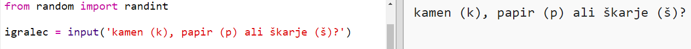

## Na vrsti je igralec

Najprej naj igralec izbira me kamnom, škarjami ali papirjem.

+ Odpri ta trinket: <a href="http://jumpto.cc/rps-go" target="_blank">jumpto.cc/rps-go</a>.

+ Projekt že vsebuje kodo za uvoz funkcije, ki jo boš uporabili v tem projektu.
    
    
    
    Kasneje boš uporabil `randint` za generiranje naključnih števil.

+ Najpprej pusti igralcu, da izbere kamen, škarje ali papir s pritiskom na črke 'k', 'š' ali 'p'.
    
    

+ Zdaj pa izpiši, kaj je igralec izbral:
    
    

+ Preizkusi kodo, tako da pritisneš `Run`. Klikni v izhodno okno trinketa in vnesi svojo izbiro.