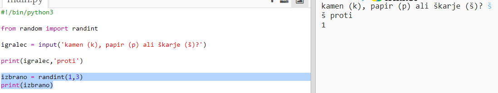

## Na vrsti je računalnik

Zdaj je na vrsti računalnik. Za ustvarjanje naključnega števila, ki bo odločalo med kamnom, škarjami in papirjem, lahko uporabiš funkcijo `randint`.

+ Uporabi `randint`, da ustvariš naključno število, ki bo odločalo o tem ali je računalnik izbral kamen, škarje ali papir.
    
    

+ Svojo skripto zaženi večkrat (vsakič boš moral vnesti 'k', 'š' ali 'p').
    
    Moral bi videti ali je spremenljivka 'izbrano' naključno določena kot 1, 2 ali 3.

+ Recimo da je:
    
    + 1 = kamen (k)
    + 2 = papir (p)
    + 3 = škarje (š)
    
    Uporabi `if`, da preveriš ali je izbrana številka `1`(`==` se uporablja za preverjanje, če sta dve stvari enaki).
    
    

+ Python uporablja **zamik** (pomikanje kode v desno), da prikaže, katera koda se nahaja znotraj `if`. Lahko uporabiš dva presledka (dvakrat pritisneš preslednico) ali enkrat pritisneš **tabulator** (ta se ponavadi nahaja nad tipko za zaklepanje velikosti črk tj. tipko CAPSLOCK).
    
    Določi, da bo `racunalnik` enako 'r' znotraj stavka `if` z uporabo zamika:
    
    

+ Lahko dodaš še drugačno preverjanja z uporabo `elif`(okrajšava za *else if*):
    
    
    
    Ta pogoj se bo preverjal zgolj v primeru, da prvi pogoj ni bil izpolnjen (računalnik ni izbral `1`).

+ In na koncu še, če računalnik ni izbral `1` ali `2`, potem je moral izbrati `3`.
    
    Tokrat lahko uporabimo zgolj `else`, kar pomeni sicer.
    
    

+ Sedaj pa - namesto tega, da izpišeš številko, ki jo je računalnik naključno izbral, lahko izpišeš črko.
    
    
    
    Vrstico `print(chosen)` lahko sedaj izbrišeš, lahko pa pred njo dodaš znak `#`, da je računalnik ne bo upošteval.

+ Preizkusi svojo kodo s klikom na Run in vnosom svoje izbire.

+ Hmm, račualnikova izbira se izpiše v novi vrstici. To lahko popraviš tako, da dodaš `end='` po besedi `proti`, kar pove Pythonu, da naj konča s presledkom, namesto z novo vrstico.
    
    

+ Nekajkrat odigraj igro, s klikom na Run in vnosom izbire.
    
    Za zdaj boš moral še sam ugotavljati, kdo je zmagal. V naslednjem koraku pa boš dodal Python kodo, ki bo to storila namesto tebe.