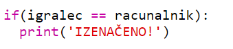
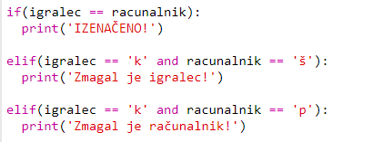
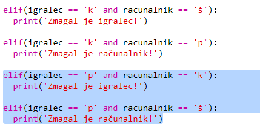
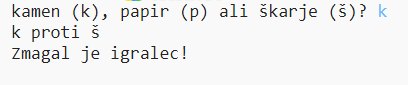

## Preveri rezultat

Zdaj pa dodajmo kodo, da vidimo, kdo je zmagal.

+ Da bi videl kdo je zmagal, moraš primerjati spremenljivki `igralec` in `racunalnik`.
    
    Če sta enaki, je rezultat neodločen:
    
    

+ Preizkusi kodo tako, da igro nekajkrat odigraš, dokler rezultat ni izenačen.
    
    Za igranje moraš klkniti na `Run`.

+ Oglejmo si primere, ko igralec izbere 'k' (kamen), računalnik pa ne.
    
    Če je računalnik izbral 'š' (škarje), igralec zmaga (kamen otopi škarje).
    
    Če računalnik izbere 'p' (papir), zmaga računalnik (papir ovije kamen).
    
    Igralčevo *in* računalnikovo izbiro lahko preverimo z uporabo `and`.
    
    

+ Nato si poglejmo še primere, ko igralec izbere 'p' (papir), računalnik pa ne:
    
    

+ Ali lahko za konec dodaš še kodo, ki poišče zmagovalca, kadar igralec izbere 'š' (škarje), računalnik pa kamen ali papir?

+ Zdaj pa igraj igro, da jo preizkusiš.
    
    
    
    Klikni `Run`, da jo zaženeš.