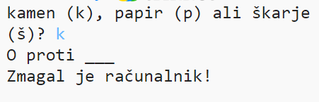
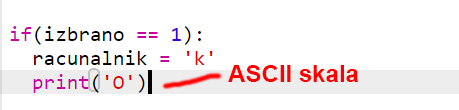
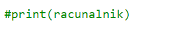
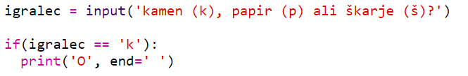

\--- challenge \---

## Izziv: ASCII umetnost

Ali lahko namesto črk k, š in p uporabiš ASCII umetnost, da prikažeš kamen, papir in škarje?

Na primer:

Kjer je:

    skala: O
    papir: ___
    škarje: >8
    

+ Instead of saying `print (computer)` you'll need to add a new line to each of the options in the `if` to print out the correct ASCII art. 

Namigi:

+ Instead of saying `print (player)` you'll need to add a new if statement to check which item the player chose and print out the correct ASCII art:

Namig:

Zapomni si, da dodatek `end=' '` na koncu `print` povzroči, da se izpis konča s presledkom in ne z novo vrstico.

+ Include a line to print `vs` between the player and computer results.

    print('vs', end=' ')
    

\--- /challenge \---