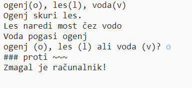

--- challenge ---

## Izziv: ustvari novo igro

Ali lahko ustvarite svojo igro, kakršna je Kamen, škarje, papir, z drugimi predmeti?

Klikni gumb 'podvoji', da ustvariš kopijo projekta Kamen, škarje, papir, ki ti bo služil kot izhodišče.

Ta primer uporablja ogenj, les in vodo:

--- /challenge ---

***

Ta projekt so prevedli prostovoljci:

Arnold Marko

Zahvaljujoč prostovoljcem, lahko ljudem po vsem svetu omogočimo, da se učijo v svojem jeziku. S prostovoljnim prevajanjem nam lahko pomagate, da dosežemo več ljudi - več informacij na [rpf.io/translate](https://rpf.io/translate).