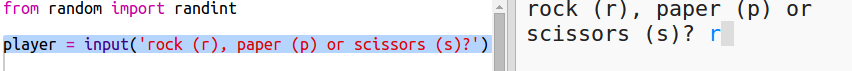

## Spelarens tur

Låt först spelaren välja Rock, Paper eller sax.

+ Öppna den här pricket: <a href="http://jumpto.cc/rps-go" target="_blank">jumpto.cc/rps-go</a>.

+ Projektet innehåller redan koden för att importera en funktion som du ska använda i det här projektet.
    
    
    
    Du använder `randint` senare för att generera slumptal.

+ Låt först spelaren välja Rock, Paper eller sax genom att skriva bokstaven 'r', 'p' eller 's'.
    
    

+ Skriv ut nu vad spelaren valde:
    
    

+ Testa din kod genom att klicka på `Kör`. Klicka i trinketutmatningsfönstret och skriv in ditt val.