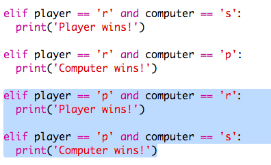

## Kontrollera resultatet

Låt oss nu lägga till koden för att se vem som vann.

+ Du måste jämföra `spelare` och `dator` variabler för att se vem som vann.
    
    Om de är lika då är det ett drag:
    
    

+ Testa din kod genom att spela spelet några gånger tills du ritar.
    
    Du måste klicka på `Kör` att starta ett nytt spel.

+ Låt oss nu titta på fallen där spelaren valde "r" (rock) men datorn gjorde det inte.
    
    Om datorn väljer 's' (sax) så vinner spelaren (rock beats sax).
    
    Om datorn väljer "p" (papper), så vinner datorn (pappersblackrock).
    
    Vi kan kontrollera spelarvalet *och* datorvalet med `och`.
    
    

+ Låt oss nu titta på de fall där spelaren valde "p" (papper) men datorn gjorde inte:
    
    

+ Och till sist kan du lägga till koden för att söka efter vinnaren när spelaren valde 's' (sax) och datorn valde rock eller papper?

+ Spela nu spelet för att testa din kod.
    
    
    
    Klicka på `Kör` att starta ett nytt spel.