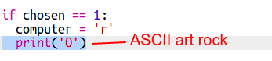

\--- utmaning \---

## Utmaning: ASCII Art

I stället för att använda bokstäverna r, p och s för att representera rock, papper och sax, kan du använda ASCII-konst?

Till exempel:

Var:

    sten: O
    papper: ___
    sax: >8
    

+ I stället för att säga `skrivare` behöver du lägga till en ny rad till var och en av alternativen i `om` att skriva ut rätt ASCII-konst. 

tips:

+ I stället för att säga `skrivare` behöver du lägga till ett nytt if-meddelande för att kontrollera vilket objekt spelaren valt och skriva ut rätt ASCII-konst:

Ledtråd:

Kom ihåg att lägga till `end = ''` till slutet av ett `skriv` gör det slut med ett mellanslag istället för en ny rad.

\--- /utmaning \---