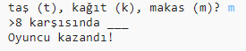

## Giriş

Bu projede Taş, Kağıt, Makas oyunu yapıp bilgisayara karşı oynayacaksınız.

Kurallar: Siz ve bilgisayar taş, kağıt ya da makastan birini seçersiniz. Kazanan şu kurallara göre belirlenir:

* Taş makası kırar
* Kağıt taşı kaplar
* Makas kağıdı keser

  <iframe src="https://trinket.io/embed/python/e1e1d873be?outputOnly=true&start=result" width="600" height="500" frameborder="0" marginwidth="0" marginheight="0" allowfullscreen>
  </iframe>
  

### Kulüp liderleri için ek bilgi

Bu projeyi yazdırmanız gerekiyorsa, lütfen [Yazıcı dostu sürümü](https://projects.raspberrypi.org/en/projects/rock-paper-scissors/print) kullanın.

## \--- collapse \---

## title: Kulüp lideri notları

## Giriş:

Bu projede, çocuklar değişkenleri ve koşullu ifadeleri kullanarak Taş, Kağıt, Makas oyunu oynatan bir programı nasıl yapacaklarını öğrenecekler.

## Çevrimiçi Kaynaklar

**Bu proje Python 3'ü kullanıyor.** Çevrimiçi Python programlama için [trinket](https://trinket.io/) kullanmanızı tavsiye ederiz. Bu proje aşağıdaki trinketleri içeriyor:

* ['Taş, Kağıt, Makas' Kaynakları - jumpto.cc/rps-go](http://jumpto.cc/rps-go)

Ayrıca tamamlanmış projeyi içeren bir trinket da bulunmaktadır:

* [Tamamlanmış 'Taş, Kağıt, Makas' projesi - trinket.io/python/e1e1d873be](https://trinket.io/python/e1e1d873be)

## Çevrimdışı Kaynaklar

Bu proje, istenirse [çevrimdışı](https://www.codeclubprojects.org/en-GB/resources/python-working-offline/) olarak tamamlanabilir. Bu proje için proje kaynaklarına, 'Proje Malzemeleri' bağlantısını tıklayarak erişebilirsiniz. Bu link, çocukların bu projeyi çevrimdışı tamamlamaları için ihtiyaç duyacağı kaynakları içeren bir 'Proje Kaynakları' bölümü içermektedir. Her çocuğun bu kaynakların bir kopyasına erişimi olduğundan emin olun. Bu bölüm aşağıdaki dosyaları içerir:

* rock-paper-scissors/rock-paper-scissors.py

Bu projenin tamamlanmış bir versiyonunu aşağıdakileri içeren 'Gönüllü Kaynaklar' bölümünde de bulabilirsiniz:

* rock-paper-scissors-finished/rock-paper-scissors.py

(Yukarıdaki kaynakların tümü proje ve gönüllü olarak indirilebilen `.zip` dosyalarıdır)

## Kazanımlar

* Değişkenler;
* Tercihler (`if`, `elif`, `else`); 
* Eşitlikler `==` and `and`.

Bu proje, [Raspberry Pi Digital Making Curriculum](http://rpf.io/curriculum) 'un aşağıdaki bölümlerinden unsurları kapsamaktadır:

* [Basit programlar oluşturmak için temel programlama yapılarını kullanın.](https://www.raspberrypi.org/curriculum/programming/creator)

## Meydan Okumalar

* "ASCII sanatı" - ASCII Sanatıyla; taş, kağıt ve makas görüntülemek için koşullu mantığı kullanın. 
* "Yeni bir oyun oluştur" - Taş, Kağıt, Makas oyununu çoğalt ve trinket'ta yeni bir oyun oluştur. 

\--- /collapse \---

## \--- collapse \---

## title: Proje materyalleri

## Proje kaynakları

* [tüm proje kaynaklarını içeren .zip dosyası](resources/rock-paper-scissors-project-resources.zip)
* ['Taş, Kağıt, Makas' projesinin tüm kaynaklarını içeren çevrimiçi Trinket](http://jumpto.cc/rps-go)
* [rock-paper-scissors/rock-paper-scissors.py](resources/rock-paper-scissors-rock-paper-scissors.py)

## Kulüp lideri için kaynaklar

* [tamamlanmış tüm proje kaynaklarını içeren .zip dosyası](resources/rock-paper-scissors-volunteer-resources.zip)
* [Çevrimiçi tamamlanmış Trinket projesi](https://trinket.io/python/e1e1d873be)
* [rock-paper-scissors-finished/rock-paper-scissors.py](resources/rock-paper-scissors-finished-rock-paper-scissors.py)

\--- /collapse \---