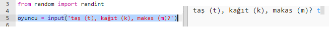
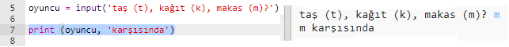

## Oyuncunun Sırası

İlk önce, oyuncu Taş, Kağıt veya Makası seçsin.

+ Şu trinketi açın: <a href="http://jumpto.cc/rps-go" target="_blank">jumpto.cc/rps-go</a>.

+ Proje içinde kullanmak üzere olduğunuz bir fonksiyon halihazırda kodlama içerisinde bulunmaktadır.
    
    
    
    `randint` komutunu daha sonra rastgele sayılar oluşturmak üzere kullanacaksınız.

+ Öncelikle, oyuncunun 't', 'k', 'm' harflerinden birini yazarak Taş, Kağıt veya Makası seçmesini sağlayın.
    
    

+ Şimdi oyuncunun ne seçtiğini yazdırın:
    
    

+ `Run` düğmesine tıklayarak kodunuzu test edin. Trinket çıktı penceresine tıklayıp, seçiminizi girin.