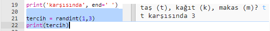
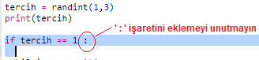
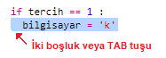
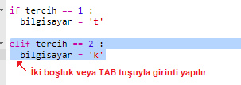
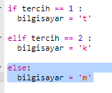
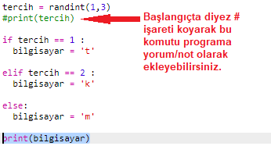
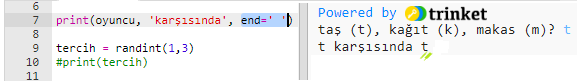

## Bilgisayarın Sırası

Şimdi bilgisayarın sırası. Taş, kağıt ve makastan birini rastgele sayı üreterek seçmek için `randint` fonksiyonunu kullanabilirsiniz.

+ Bilgisayarın taş, kağıt ya da makas mı seçtiğine karar vermesi için `randint` fonksiyonuyla rastgele bir sayı oluşturun.
    
    

+ Komut dosyanızı birçok kez çalıştırın (her seferinde 't', 'k' veya 'm' harflerini girmeniz gerekir.)
    
    'Tercih' öğesinin rastgele olarak 1, 2 veya 3 olarak ayarlandığını görmelisiniz.

+ Diyelimki:
    
    + 1 = taş (t)
    + 2 = kağıt (k)
    + 3 = makas (m)
    
    `1`'in seçilmiş olduğunu kontrol etmek için `if` fonksiyonunu kullanın (`==` fonksiyonu 2 şeyin birbirine eşit olup olmadığını görmek için kullanılır).
    
    

+ Python, hangi kodun `if` fonksiyonu içinde olduğunu göstermek için (kodu sağa doğru hareket ettirerek) **girinti** kullanır. Girinti yapmak için ya iki boşluk bırakın (boşluk tuşuna iki kez basarak) ya da **TAB** tuşuna (genellikle klavyede büyük harf kilidinin hemen üstünde - CAPSLOCK) dokunun
    
    `if` fonksiyonunun içine `bilgisayarın` 't' yazmasını girinti kullanarak ayarlayın:
    
    

+ Alternatif kontrol amacıyla `elif` (*else if* 'in kısaltması) fonksiyonunu ekleyebilirsiniz:
    
    
    
    Bu koşul yalnızca ilk durumun başarısız olması durumunda kontrol edilir (bilgisayar `1`'i seçmediyse)

+ Ve nihayet, bilgisayar `1`'i veya `2`'yi seçmediyse, o zaman `3` seçilmiş olmalı.
    
    Şimdi de sadece, 'aksi takdirde, yoksa' anlamına gelen `else` fonksiyonunu kullanabiliriz.
    
    

+ Bilgisayarın seçtiği rastgele sayıyı yazdırmak yerine, harfi yazdırabilirsiniz.
    
    
    
    İsterseniz ya `print(tercih)` satırını silersiniz ya da başına diyez `#` işareti ekleyerek bilgisayarın yok saymasını sağlayabilirsiniz.

+ Çalıştır'a tıklayıp, tercihinizi yaparak programınızı test edin.

+ Hmm, Bilgisayarın tercihi yeni satıra yazıldı. Bunu `karşısında` ibaresinden sonra `end=' '`, fonksiyonunu ekleyerek Python'un yeni bir satır yerine boşluğa yazmasını sağlayabilirsiniz.
    
    

+ Çalıştır'ı tıklatarak ve bir seçim yaparak oyunu birkaç kez oynayın.
    
    Şimdilik kimin kazandığını kendin hesaplamalısın. Daha sonra bunu çözmek için Python kodunu ekleyeceksiniz.