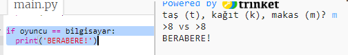
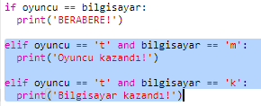
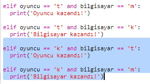
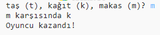

## Sonucu Kontrol Et

Şimdi kimin kazandığını görmek için kodu ekleyelim.

+ Kimin kazandığını görmek için `oyuncu` ve `bilgisayar` değişkenlerini karşılaştırmanız gerekiyor.
    
    Eğer tercihleri aynıysa bu beraberliktir:
    
    

+ Bir beraberlik elde edene kadar birkaç kez oyunu oynayarak kodunuzu test edin.
    
    Yeni bir oyuna başlamak için `Run` (çalıştır) 'a tıklaman gerekir.

+ Şimdi oyuncunun 't' (taş)'ı seçtiği ancak bilgisayarın yapmadığı durumlara bakalım.
    
    Bilgisayar 'm' (makas)'ı seçerse, oyuncu kazanır (taş makası yener).
    
    Bilgisayar 'k' (kağıt)'ı seçerse, o zaman bilgisayar kazanır (kağıt, taşı yener).
    
    Oyuncunun *ve* bilgisayarın seçimini `and` fonksiyonunu kullanarak kontrol edebiliriz.
    
    

+ Şimdi oyuncunun 'k' (kağıt)'ı seçtiği ancak bilgisayarın yapmadığı durumlara bakalım:
    
    

+ Sonunda, oyuncu 'm' (makas)'ı seçtiğinde ve bilgisayar taş veya kağıt seçtiğinde kazananı kontrol etmek için kod ekleyebilir misin?

+ Şimdi kodunuzu test etmek için oyunu oynayın.
    
    
    
    Yeni bir oyuna başlamak için `Run` (çalıştır) 'a tıklayın.