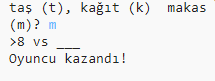

\--- challenge \---

## Meydan Okuma: ASCII Sanatı

Taş, kâğıt ve makası temsil etmek için t, k ve m harflerini kullanmak yerine, ASCII sanatını kullanabilir misiniz?

Örneğin:

Nerede:

    taş: O
    kağıt: ___
    makas: >8
    

+ Instead of saying `print (computer)` you'll need to add a new line to each of the options in the `if` to print out the correct ASCII art. 

İpuçları:

+ Instead of saying `print (player)` you'll need to add a new if statement to check which item the player chose and print out the correct ASCII art:

İpucu:

`print` fonksiyonunun içine `end=' '` ifadesini ekleyince yazıyı yeni bir satır yerine yerine boşlukta bitirmesini sağladığını unutmayın.

+ Include a line to print `vs` between the player and computer results.

    print('vs', end=' ')
    

\--- /challenge \---