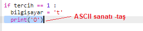

--- challenge ---

## Meydan Okuma: ASCII Sanatı

Taş, kâğıt ve makası temsil etmek için t, k ve m harflerini kullanmak yerine, ASCII sanatını kullanabilir misiniz?

Örneğin:

Nerede:

    taş: O
    kağıt: ___
    makas: >8
    

+ Doğru ASCII sanat ifadelerini yazdırmak için `print bilgisayar` komutu yerine her bir `if` fonksiyonuna yeni bir satır eklemelisiniz. 

İpuçları:

+ Doğru ASCII sanat ifadelerini yazdırmak için `print oyuncu` komutu yerine oyuncunun tercihini kontrol eden 'if' fonksiyonu eklemelisiniz:

İpucu:

`print` fonksiyonunun içine `end=' '` ifadesini ekleyince yazıyı yeni bir satır yerine yerine boşlukta bitirmesini sağladığını unutmayın.

--- /challenge ---