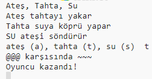

--- challenge ---

## Meydan Okuma: Yeni bir oyun yaratın

Farklı nesnelerle Taş, Kağıt, Makas'a benzer kendi oyununu yaratabilir misin?

Başlamak için 'Çoğalt' tuşuna tıklayarak Taş, Kağıt, Makas projenizin bir kopyasını yapın.

Bu örnekte Ateş, Tahta ve Su kullanılmaktadır:

--- /challenge ---

***
Bu proje gönüllüler tarafından tercüme edildi:

Volkan Çevik

Berkan Ali

Dünyanın dört bir yanındaki insanlara anadilinde öğrenme şansı verebildiğimiz için gönüllülere teşekkür ederiz. Daha fazla gönüllü tercümana ulaşmamızda bize yardımcı olabilirsiniz - [rpf.io/translate](https://rpf.io/translate) adresinden daha fazla bilgiye ulaşabilirsiniz.