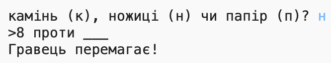

## Вступ

У цьому проекті ви зробите гру Rock, Paper, Scissors та граєте проти комп'ютера.

Правила: Ви та комп'ютер обидва обираєте рок, папір або ножиці. Переможець визначається цими правилами:

* Рок забиває ножиці
* Папір покриває рок
* Ножиці вирізали папір

  <iframe src="https://trinket.io/embed/python/e1e1d873be?outputOnly=true&start=result" width="600" height="500" frameborder="0" marginwidth="0" marginheight="0" allowfullscreen>
  </iframe>
  

### Додаткова інформація для керівників гуртка

Якщо вам потрібно роздрукувати цей проект, скористайтеся [ Версія для друку ](https://projects.raspberrypi.org/en/projects/rock-paper-scissors/print).

## \--- collapse \---

## title: Нотатки керівника гуртка

## Вступ:

У цьому проекті діти навчаться програмі Rock, Paper, Scissors, використовуючи змінні та умовні вирази.

## Онлайн Ресурси

**Цей проект використовує Python 3.** Ми рекомендуємо використовувати [trinket](https://trinket.io/) для написання Python в Інтернеті. Цей проект містить наступні трінкети:

* [Ресурси "Рок, Папір, Ножиці" - jumpto.cc/rps-go](http://jumpto.cc/rps-go)

Також є трінкет, що містить завершений проект:

* ['Rock, Paper, Scissors' Готово - trinket.io/python/e1e1d873be](https://trinket.io/python/e1e1d873be)

## Офлайн Ресурси

Цей проект може бути [виконаний офлайн](https://www.codeclubprojects.org/en-GB/resources/python-working-offline/), якщо потрібно. Ви можете отримати доступ до ресурсів проекту, натиснувши посилання " Матеріали проекту" для цього проекту. Це посилання містить розділ "Ресурси проекту", який включає в себе ресурси, які дітям доведеться використовувати, щоб завершити цей проект в режимі офдайн. Переконайтеся, що кожна дитина має доступ до копії цих ресурсів. Ця версія містить наступні файли:

* рок-папір-ножиці / rock-paper-scissors.py

Ви також можете знайти завершену версію цього проекту у розділі "Ресурси волонтера", яка містить:

* рок-папір-ножиці-готові / rock-paper-scissors.py

(Усі вищезазначені ресурси можна також завантажувати як проекти та волонтерські файли `.zip` files.)

## Цілі навчання

* Змінні;
* Вибір (`якщо`, `elif`, `ще`); 
* Булеві `==` і `і`.

Цей проект охоплює елементи з наступними стандартами оформлення навчального плану [Raspberry Pi](http://rpf.io/curriculum):

* [Використайте основні конструкції для створення простих програм.](https://www.raspberrypi.org/curriculum/programming/creator)

## Завдання

* "ASCII art" - Використовуйте умовну логіку для показу ASCII мистецтва для каменю, паперу та ножиць. 
* "Створити нову гру" - повторюйте гру Рок, Папір, Ножиці та ремішіть її, щоб створити нову гру. 

\---collapse\---

## \---collapse\---

## title: Матеріали проекту

## Проектні ресурси

* [.zip файли, що містять всі проектні ресурси](resources/rock-paper-scissors-project-resources.zip)
* [Інтернет-брелок з усіма ресурсами проекту "Рок, Папір, Ножиці"](http://jumpto.cc/rps-go)
* [рок-папір-ножиці / rock-paper-scissors.py](resources/rock-paper-scissors-rock-paper-scissors.py)

## Ресурси лідерів клубу

* [.zip-файл, що містить всі ресурси завершеного проекту](resources/rock-paper-scissors-volunteer-resources.zip)
* [Завершений "Трінкет" проект](https://trinket.io/python/e1e1d873be)
* [рок-папір-ножиці-готові / rock-paper-scissors.py](resources/rock-paper-scissors-finished-rock-paper-scissors.py)

\--- /collapse \---