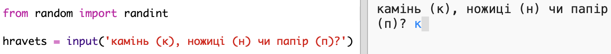
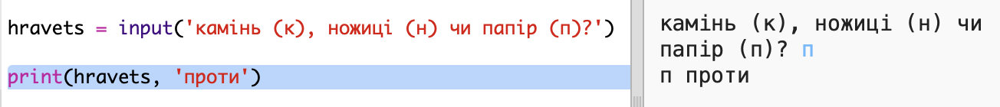

## Обертання гравця

По-перше, дозвольте гравцеві вибрати Рок, Папір або Ножиці.

+ Відкрийте цей trinket:<a href="http://jumpto.cc/rps-go" target="_blank">jumpto.cc/rps-go</a>.

+ Проект вже містить код для імпорту функції, яку ви збираєтеся використовувати в цьому проекті.
    
    
    
    Пізніше ви використаєте `randint` для генерації випадкових чисел.

+ По-перше, дозвольте гравцеві вибрати Рок, Папір або Ножиці, набравши літери "r", "p" або "s".
    
    

+ Тепер роздрукуйте, який гравець вибрав:
    
    

+ Перевірте свій код, натиснувши `Виконайте`. Клацніть у вікні виведення брелоків і введіть свій вибір.