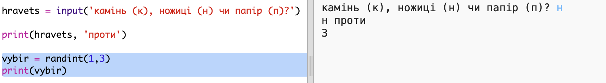
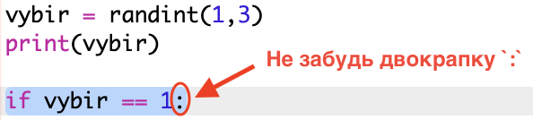
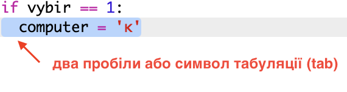
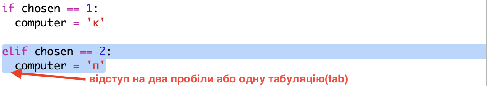
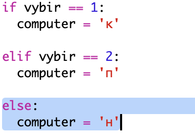
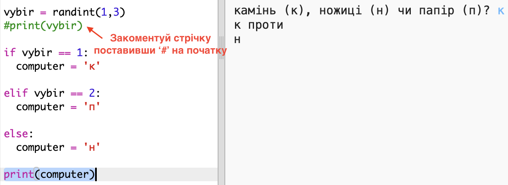
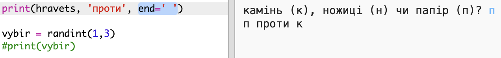

## Обертання комп'ютера

Тепер це обертання комп'ютера. Ви можете скористатись функцією `randint` , щоб створити випадкове число, щоб вирішувати між роком, папером та ножицями.

+ Використовуйте `randint` , щоб створити випадкове число, щоб вирішити, чи комп'ютер обрали камінь, папір або ножиці.
    
    

+ Запустіть сценарій багато разів (вам доведеться кожного разу вводити 'r', 'p' або 's').
    
    Ви повинні побачити, що "обраний" випадковим чином встановлений як 1, 2 або 3.

+ Скажімо:
    
    + 1 = скеля (г)
    + 2 = папір (р)
    + 3 = ножиці
    
    Використовуйте `, якщо` перевірити, чи вибраний номер `1` (`==` використовується, щоб побачити, чи є 2 речі однакові).
    
    

+ Python використовує **відступом** (переміщення коду вправо), щоб показати, який код знаходиться в області `, якщо`. Ви можете або використовувати два пробіли (двічі торкніться пробіл) або торкніться **клавіші вкладки** (зазвичай над клавіатурою CAPSLOCK).
    
    Встановіть `комп'ютер` на "r" всередині `, якщо` , використовуючи відступи:
    
    

+ Ви можете додати альтернативну перевірку, використовуючи `elif` (коротше за *, якщо*):
    
    
    
    Цей стан буде перевірено, лише якщо перша умова не виконається (якщо комп'ютер не вибрав `1`)

+ І, нарешті, якщо комп'ютер не вибрав `1` або `2` , то він мав вибрати `3`.
    
    Цього разу ми можемо просто використати `ще` , що означає інше.
    
    

+ Тепер, замість того, щоб друкувати випадкове число, яке вибрали комп'ютер, ви можете надрукувати лист.
    
    
    
    Ви можете видалити рядок `print (вибрано)`або зробити комп'ютер ігнорувати його, додавши `#` на початку рядка.

+ Перевірте свій код, натиснувши Виконати та вибравши свій параметр.

+ Хм, вибір комп'ютера надруковано на новій лінії. Ви можете виправити це, додавши `end = ''` після `проти`, що говорить, що Python закінчується пробілом, а не новою лінією.
    
    

+ Грайте в гру декілька разів, натиснувши "Виконати" та зробити вибір.
    
    Наразі вам доведеться розібратися, хто виграв себе. Далі ви додасте код Python для роботи над цим.