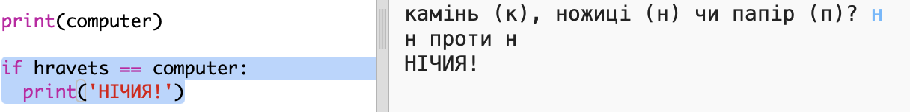
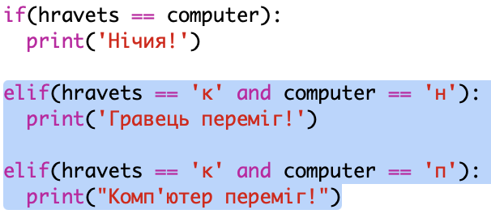
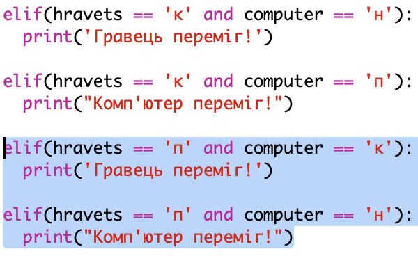
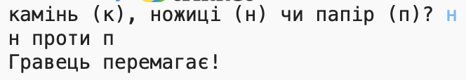

## Перевірте результат

Тепер давайте додамо код, щоб побачити, хто виграв.

+ Вам потрібно зіставити `` та `комп'ютера` змінні, щоб побачити, хто виграв.
    
    Якщо вони однакові, то це жеребкування:
    
    

+ Перевірте свій код, граючи гру кілька разів, поки не отримаєте жеребкування.
    
    Вам потрібно буде натиснути `Запустити` , щоб запустити нову гру.

+ Тепер давайте розглянемо випадки, коли гравець вибрав 'r' (rock), але комп'ютер це не зробив.
    
    Якщо комп'ютер вибрав 's' (scissors), то гравець виграє (rock beats scissors).
    
    Якщо комп'ютер вибрав 'p' (папір), то комп'ютер перемагає (папір б'є рок).
    
    Ми можемо перевірити вибір програвача *та* вибору комп'ютера за допомогою `та`.
    
    

+ Далі давайте розглянемо випадки, коли гравець вибрав 'p' (папір), але комп'ютер не зробив:
    
    

+ І, нарешті, чи можете ви додати код для перевірки переможця, коли гравець вибрав 's' (ножиці), і комп'ютер вибрав камінь або папір?

+ Тепер грайте в гру, щоб перевірити свій код.
    
    
    
    Натисніть `Запустити` , щоб запустити нову гру.