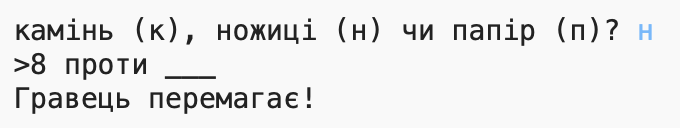
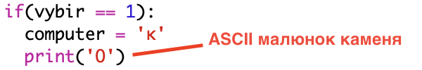
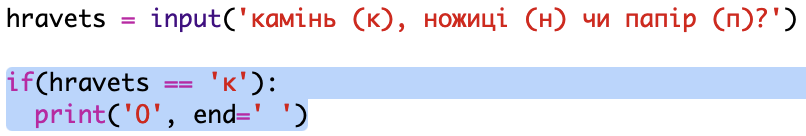

\--- challenge \---

## Завдання: псевдографіка ASCII

Замість літер «к», «п» та «н» на позначення каменю, паперу та ножиць можна скористатися псевдографікою ASCII.

Наприклад:

Де:

    камінь: O
    папір: ___
    ножиці: >8
    

+ Замість рядка `print(computer)` ти додаси новий рядок до кожного блоку `if`, щоб вивести потрібну ASCII-графіку. 

Підказка:

+ Замість того, щоб використовувати `print(hravets)`, тобі слід додати новий оператор if, щоб перевірити вибір гравця та вивести правильну ASCII-графіку:

Підказка:

Не забувай, що додавання параметра `end=' '` у функцію `print`, ставить пробіл в кінець виведеного рядка замість символу нового рядка.

+ Додай рядок, який виведе `проти` між результатами гравця і комп'ютера.

    print('проти', end=' ')
    

\--- /challenge \---