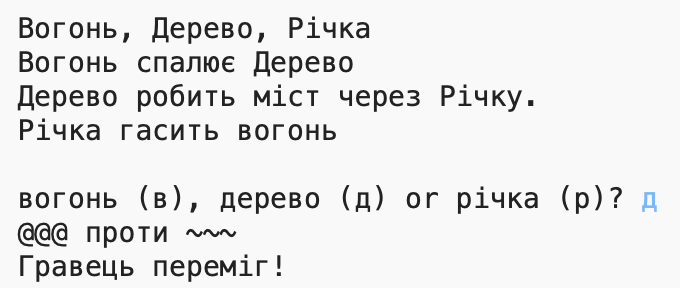

--- challenge ---

## Завдання: створи нову гру

Чи можеш ти створити свою власну гру, схожу на «Камінь, ножиці, папір», але з іншими предметами?

Для початку натисни кнопку «Duplicate», щоб зробити копію свого проєкту «Камінь, ножиці, папір».

У цьому прикладі використовуються вогонь, дерево та вода:

--- /challenge ---

***

Цей проєкт переклали волонтери:

Михайло Тимчишин
Володимир Соботович

Завдяки волонтерам ми надаємо можливість людям у всьому світі навчатися рідною мовою. Ви також можете допомогти нам у цьому — більше інформації про волонтерську програму на [rpf.io/translate](https://rpf.io/translate).