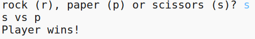

## Kiểm tra kết quả

Bây giờ hãy thêm mã để xem ai đã thắng.

+ Bạn cần phải so sánh `người chơi` và `máy tính` biến để xem ai đã thắng.
    
    Nếu họ giống nhau thì đó là một trận hòa:
    
    

+ Kiểm tra mã của bạn bằng cách chơi trò chơi một vài lần cho đến khi bạn nhận được một trận hòa.
    
    Bạn sẽ cần phải bấm `Chạy` để bắt đầu trò chơi mới.

+ Bây giờ hãy xem xét các trường hợp người chơi chọn 'r' (rock) nhưng máy tính thì không.
    
    Nếu máy tính chọn 's' (kéo) thì người chơi thắng (rock beats scissors).
    
    Nếu máy tính chọn 'p' (giấy) thì máy tính sẽ thắng (giấy đập đá).
    
    Chúng ta có thể kiểm tra sự lựa chọn của người chơi *và* lựa chọn máy tính bằng cách sử dụng `và`.
    
    

+ Tiếp theo hãy xem xét các trường hợp người chơi chọn 'p' (giấy) nhưng máy tính không:
    
    

+ Và cuối cùng, bạn có thể thêm mã để kiểm tra người chiến thắng khi người chơi chọn 's' (kéo) và máy tính đã chọn đá hoặc giấy?

+ Bây giờ chơi trò chơi để kiểm tra mã của bạn.
    
    
    
    Nhấp vào `Chạy` để bắt đầu trò chơi mới.