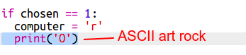

\--- thử thách \---

## Thách thức: Nghệ thuật ASCII

Thay vì sử dụng các chữ r, p và s để biểu diễn đá, giấy và kéo, bạn có thể sử dụng nghệ thuật ASCII không?

Ví dụ:

Ở đâu:

    đá: O
    giấy: ___
    kéo: >8
    

+ Thay vì nói `máy tính in` bạn sẽ cần phải thêm một dòng mới cho mỗi tùy chọn trong `nếu` để in ra chính xác ASCII nghệ thuật. 

Gợi ý:

+ Thay vì nói `print player` bạn sẽ cần phải thêm một câu lệnh if mới để kiểm tra mục mà người chơi đã chọn và in ra đúng nghệ thuật ASCII:

Dấu:

Hãy nhớ rằng việc thêm `end = ''` vào cuối của `print` làm cho nó kết thúc bằng một khoảng trống thay vì một dòng mới.

\--- /thử thách \---