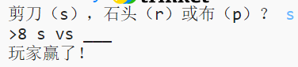

## 介绍

你将在本项目中制作一个石头、剪刀、布游戏并与电脑对战。  

规则：你和电脑可选择石头、布或剪刀。通过以下规则来决定胜负：

+ 石头使剪刀变钝
+ 布覆盖石头
+ 剪刀剪断布

  <iframe src="https://trinket.io/embed/python/e1e1d873be?outputOnly=true&start=result" width="600" height="500" frameborder="0" marginwidth="0" marginheight="0" allowfullscreen>
  </iframe>
  

### 更多俱乐部领导参考信息

如果你需要打印本项目，请使用 [适合打印机的版本](https://projects.raspberrypi.org/en/projects/rock-paper-scissors/print)。

--- collapse ---
---
title: 俱乐部领导备注
---

## 介绍：
孩子们将在本项目中学习如何运用变量和条件语句制作一个玩石头、剪刀、布游戏的程序。 

## 在线资源

__本项目使用 Python 3__ 我们推荐使用 [trinket]（https://trinket.io/）在线编写 Python。本项目包含以下 Trinket：

+ [“石头、剪刀、布”资源 -- jumpto.cc/rps-go](http://jumpto.cc/rps-go)

还有一个 Trinket 包含完整项目：

+ [“石头、剪刀、布”已完成 -- trinket.io/python/e1e1d873be](https://trinket.io/python/e1e1d873be)

## 离线资源
如果希望的话，本项目可[离线完成](https://www.codeclubprojects.org/en-GB/resources/python-working-offline/)。你可以通过单击此项目的“项目材料”链接来访问项目资源。此链接包含一个“项目资源”部分，其中包括孩子们离线完成本项目时所需的资源。确保每个孩子都能访问这些资源的副本。本节包括以下文件：

+ rock-paper-scissors/rock-paper-scissors.py

你还可以在'志愿者资源'部分中找到本项目的完整版本，其中包含：

+ rock-paper-scissors-finished/rock-paper-scissors.py

（以上所有的资源也可以作为项目和志愿者 `.zip` 文件下载。）

## 学习目标
+ 变量；
+ 选择（`if`、`elif`、`else`）； 
+ 布尔型 `==` 和 `and`。

本项目包括 [Raspberry Pi 数字制作课程](http://rpf.io/curriculum) 以下几个部分的元素：

+ [使用基本编程结构创建简单程序。](https://www.raspberrypi.org/curriculum/programming/creator)

## 挑战
+ “ASCII 艺术”- 使用条件逻辑来显示石头、剪刀、布的 ASCII 艺术。 
+ “创建新游戏”- 复制石头、剪刀、布游戏并将其混合来创建一个新游戏。 

--- /collapse ---

--- collapse ---
---
title: 项目材料
---
## 项目资源
* [包含所有项目资源的 .zip 文件](resources/rock-paper-scissors-project-resources.zip)
* [包含所有“石头、剪刀、布”项目资源的在线 Trinket](http://jumpto.cc/rps-go)
* [rock-paper-scissors/rock-paper-scissors.py](resources/rock-paper-scissors-rock-paper-scissors.py)

## 俱乐部领导资源
* [包含所有已完成项目资源的 .zip 文件](resources/rock-paper-scissors-volunteer-resources.zip)
* [在线已完成 Trinket 项目](https://trinket.io/python/e1e1d873be)
* [rock-paper-scissors-finished/rock-paper-scissors.py](resources/rock-paper-scissors-finished-rock-paper-scissors.py)

--- /collapse ---
