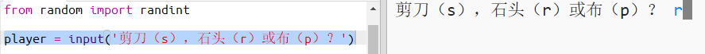
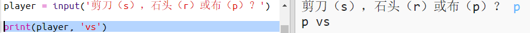

## 玩家回合

首先，让玩家选择石头、布或剪刀。 

+ 打开这个 trinket：<a href="http://jumpto.cc/rps-go" target="_blank">jumpto.cc/rps-go</a>。 

+ 项目中已包含相关代码，用于导入你将在本项目中使用的函数。 

  
  
  你随后将使用 `randint` 来生成随机数字。

+ 首先，让玩家通过输入字母“r”、“p”或“s”来选择石头、布或剪刀。 

  
  
+ 现在打印输出玩家的选择：

  
  
+ 点击`运行`来测试你的代码。点击 trinket 输出窗口并输入你的选择。 

