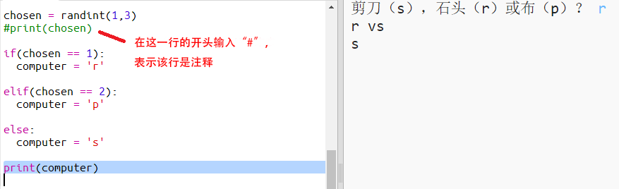

## 电脑回合

现在轮到电脑回合。你可以使用 `randint` 函数生成一个随机数字，来决定是选择石头、布还是剪刀。 

  

+ 使用 `randint` 生成一个随机数字来决定电脑选择石头、布还是剪刀。 

  
  
+ 多次运行你的脚本（你每次都需要输入“r”、“p”或“s”。）
  
  你会看到“chosen”被随机设为 1、2 或 3。 
  
+ 让我们假设：
  
  + 1 = 石头 (r)
  + 2 = 布 (p)
  + 3 = 剪刀 (s)

  使用 `if` 来检查被选中的数字是否为 `1`（`==` 用于查看 2 个选择是否相同）。 
  
  
  
+ Python 使用缩进 向右移动代码）来显示哪些代码位于 `if` 内部。你可以使用两个空格（敲击两次空格键）或者敲击 tab 键（通常位于键盘上的 CAPSLOCK 上方。）

  使用缩进在 `if` 内部将 `computer` 设为“r”：
  
  
  
+ 你可以使用 `elif`（​_else if_ 的简称）添加备选检查措施：

  

  这个条件只有在第一条件无效（如果电脑未选择 `1`）的情况下才会被检查
  
+ 最终，如果电脑未选择 `1` 或 `2`，那么就一定会选择 `3`。 

  这时我们只需使用意为否则的 `else`。 
  
  
  
+ 现在，你可以打印出字母而非打印输出电脑选择的随机数字。 

   
   
   你可以删除 `print(chosen)` 行，或者在该行开头添加一个 `#` 使电脑忽略该行。
      
+ 点击运行并选择你的选项来测试你的代码。 

+ 嗯，电脑的选择在新的一行打印出来了。你可以通过在 `vs` 后面添加 `end=' '` 来解决这个问题，这会告诉 Python 来以空格而非新的一行结束。 

   
      
+ 点击运行并作出选择来多次进行游戏。

  目前而言，你必须自行判断哪方获胜。接下来你将添加 Python 代码来解决这个问题。   
  

