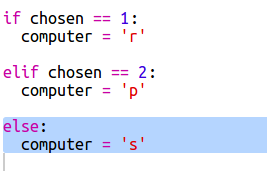

## 电脑的回合

现在轮到电脑了。 您可以使用`randint`函数来生成随机数并用以选择剪刀、石头或布。

+ 使用`randint`生成一个随机数，以决定计算机选择了剪刀、石头或布中的哪一个。
    
    

+ 多次运行你的程序（你每次都需要输入's'，'r'或'p'。）
    
    您应该看到那个输入选择被随机设置为1,2或3。

+ 让我们设定：
    
    + 1 = 石头（r）
    + 2 = 布（p）
    + 3 = 剪刀（s）
    
    使用`if`来检测随机选择的数字是否等于`1`（使用`==`来检测两个事物是否相同）。
    
    

+ Python使用**缩进**（将代码向右移动）来显示哪些代码是在`if`语句之内的。 你可以用两个空格符号（按空格键两次）或按**tab键**（通常在大写锁定键的上方）来输入缩进。
    
    在`if`语句内，将`computer`变量的值设为'r'。
    
    

+ 您还可以添加一个`elif`语句（*else if*的缩写）来做进一步的测试。
    
    
    
    只有当第一个条件语句测试未通过的情况下（即当电脑没有选择`1`），这个条件语句才会被检测。

+ 最后，如果电脑没有选择`1`或`2`，那么它一定选择了`3`。
    
    这里我们可以用`else`来表示最后一个可能性。
    
    

+ 接下来，与其直接显示电脑选择的数字，你可以显示相对应的字母。
    
    
    
    你可以删除`print(chosen)`这一行，或者在这一行开头插入`#`来指示计算机忽略这一行。

+ 点击“Run”按钮并输入您的选项来测试代码。

+ 嗯，电脑的选择被显示在新的一行上了。 您可以通过在`vs`之后添加`end =''`来解决这个问题，告诉Python以空格而不是新行结束。
    
    

+ 通过点击"Run"并做出选择，重复玩这个游戏几次。
    
    现在你得靠自己去解决谁赢了的问题。 按下来您将添加Python代码来解决这个问题。