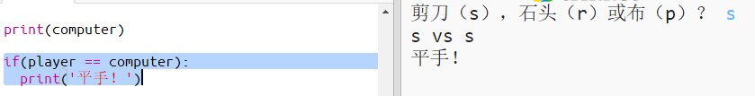
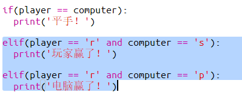
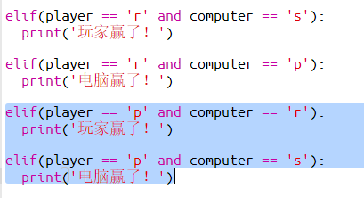
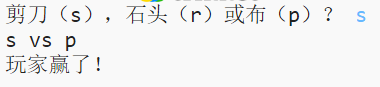

## 检查结果

现在，让我们来添加代码来决定谁赢了。

+ 你需要比较`player`和`computer`这两个变量来决定谁赢了。
    
    如果它们相同，则是平手。
    
    

+ 重复你的游戏，直到出现平手。
    
    你需要点击`Run`按钮，开始新一轮游戏。

+ 接下来，让我们再来看看当玩家选择了'r'（石头），但电脑没有选择这个的情况。
    
    如果电脑选择了's'（剪刀），那么玩家就赢了（石头胜出剪刀）。
    
    如果电脑选择了'p'（布），那么电脑就赢了（布胜石头）。
    
    我们可以使用`and`来检测玩家的选择*和*电脑的选择。
    
    

+ 接下来，让我们再来看看当玩家选择了'p'（布），但电脑没有选择布的情况。
    
    

+ 最后，你能不能试试添加代码来检查当玩家选择了's'（剪刀）但电脑选择了石头或布的情况下，如何决定谁赢了？

+ 现在运行这个游戏来测试你的代码。
    
    
    
    点击`Run`来开始新一轮游戏。