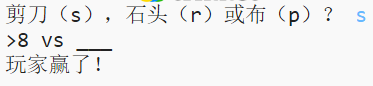
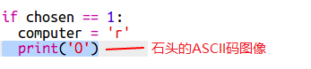
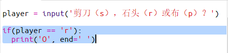

--- challenge ---

## 挑战：ASCII 艺术图形

你能使用ASCII码图像替代字母r，p和s，来代表石头，布和剪刀吗？

例如：

其中：

    石头：O
    布：___
    剪刀：>8
    

+ 在每个选项的`if`语句中，你需要添加一行新代码来显示各个选项的ASCII 艺术图形，并取代已有的`print computer`语句。 

提示：

+ 你需要添加一个新的if语句来检查玩家的选择并显示相应的ASCII 艺术图形，用以取代已有的`print player`语句。

提示：

记得在`print`中添加`end =' '`使它以空格结束而不是另起一行。

--- challenge ---