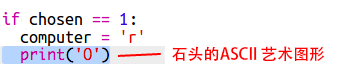

--- challenge ---
## 挑战：ASCII 艺术

除了使用字母 r、p 和 s 来代表石头、布和剪刀，你能否使用 ASCII 艺术？

例如：


其中：
```
rock: O
paper: ___
scissors: >8
```

+ 你将需要向 `if` 内的各选项添加新的一行来打印输出正确的 ASCII 艺术，而不是说 `print computer`。 

提示：




+ 你将需要添加一个新的 if 语句来检查玩家选择哪一项并打印输出正确的 ASCII 艺术，而不是说 `print player`：

提示：


请记得在 `print` 的末尾添加 `end=' '` 来使其以空格而非新的一行结束。 


--- /challenge ---